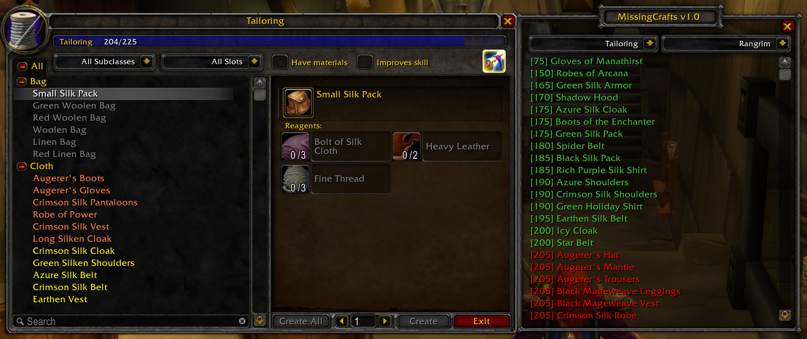
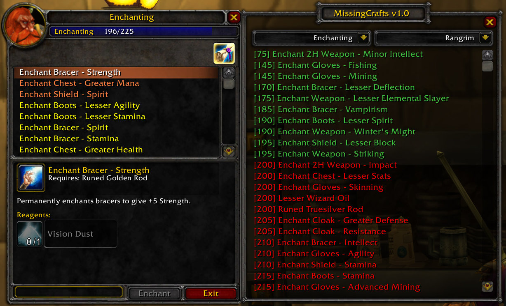
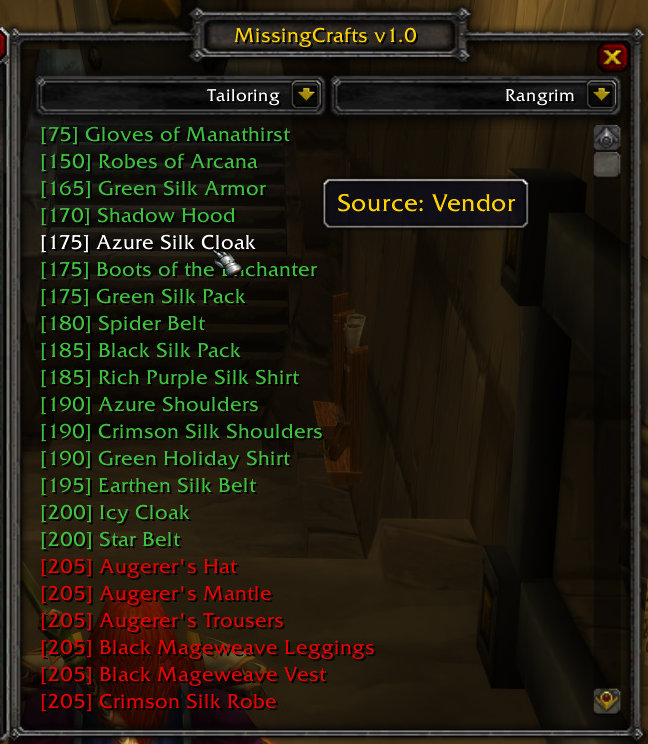
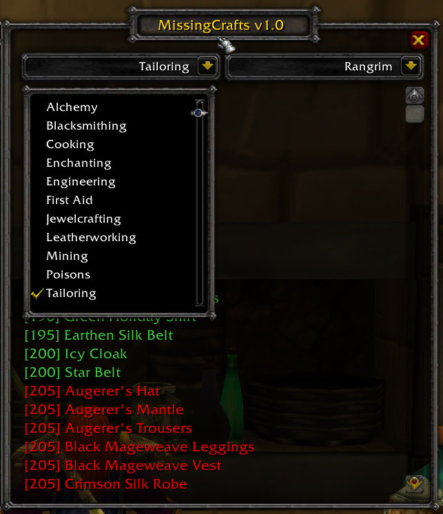
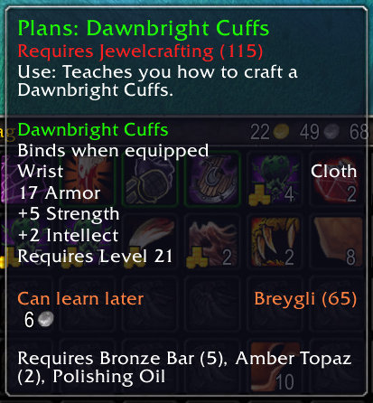

# MissingCrafts

A World of Warcraft addon for Vanilla WoW (1.12.1) and Turtle WoW that helps players track crafting recipes they haven't learned yet across their characters.

## Features

- **Integrated Profession Window**: Attachable window that appears next to profession frames showing missing recipes
- **Cross-Character Recipe Tracking**: Monitor recipe knowledge across all characters on your account
- **Enhanced Item Tooltips**: Shows which characters can learn recipes from items and their current learning status
- **Advanced Filtering**: Filter missing recipes by profession and character with intuitive dropdown menus
- **Recipe Source Information**: Displays how to obtain each missing recipe (Vendor, Quest, Drop, etc.)
- **Multiple Profession Frame Support**: Works seamlessly with default WoW frames and popular profession addons
- **All Vanilla Crafting Professions**: Supports all vanilla crafting professions
- **Turtle WoW Support**: Full support for all Turtle WoW custom recipes including the complete Jewelcrafting and Disguise professions with English, Portuguese, Spanish, and Chinese language support
- **Multi-Language Support**: Available in English, German, French, Spanish, Portuguese, Russian, Korean, Chinese (Simplified), and Chinese (Traditional)

## How to Use

1. Open any crafting profession window
2. Click the recipe button in the upper right corner of the profession frame
3. The MissingCrafts window will open, showing all recipes you haven't learned yet
4. Use the dropdown filters to narrow down recipes by profession or character
5. Hover over recipes to see their source information

## Supported Profession Windows

- Default WoW profession windows
- Turtle WoW improved Trade Skill window
- [**AdvancedTradeSkillWindow**](https://github.com/laytya/AdvancedTradeSkillWindow-vanilla)
- [**AdvancedTradeSkillWindow2**](https://github.com/Shellyoung/AdvancedTradeSkillWindow2)
- [**Artisan**](https://github.com/Otari98/Artisan)

## Comparison with [MissingTradeSkillsList](https://github.com/refaim/MissingTradeSkillsList)

MissingCrafts is a completely new addon built from scratch, offering significant improvements over MissingTradeSkillsList.

### Key Advantages
- **Active Development**: Actively maintained and developed, while MissingTradeSkillsList development is frozen due to maintenance complexity
- **Lightweight & Stable**: Built from the ground up with clean architecture that is much lighter and significantly less buggy
- **Enhanced Localization**: Better language support designed specifically for Vanilla WoW with more comprehensive translations
- **Turtle WoW Integration**: Full support for all Turtle WoW custom recipes including the complete Jewelcrafting and Disguise professions with English, Portuguese, Spanish, and Chinese language support
- **No Dependencies**: Works independently without requiring additional addon dependencies
- **Universal UI Support**: Compatible with all major profession UI addons out of the box

### Disadvantages
- **No Built-in Database**: Does not contain a built-in database with specific trainers, vendors, quests, or mobs. For detailed information, refer to [classicdb.ch](https://classicdb.ch), [classic.wowhead.com](https://classic.wowhead.com), or [database.turtle-wow.org](https://database.turtle-wow.org)
- **Limited Filtering Options**: No faction or specialization filtering for crafts (planned for future updates)

## Screenshots

#### MissingCrafts window attached to the Tailoring profession frame, showing missing recipes with skill level requirements and source information

#### Integration with the Enchanting profession frame, displaying missing enchant recipes sorted by skill level

#### Detailed recipe information in the main window showing skill requirements and acquisition sources

#### Dropdown menu allowing you to filter missing recipes by profession, supporting all crafting professions including Turtle WoW's Jewelcrafting

#### Enhanced item tooltip showing recipe learning status - which characters can learn it and their current profession level

## Acknowledgments
- Inspired by [MissingTradeSkillsList](https://github.com/refaim/MissingTradeSkillsList)
- Built using [**Ace3**](https://github.com/laytya/Ace3v) framework for robust addon architecture
